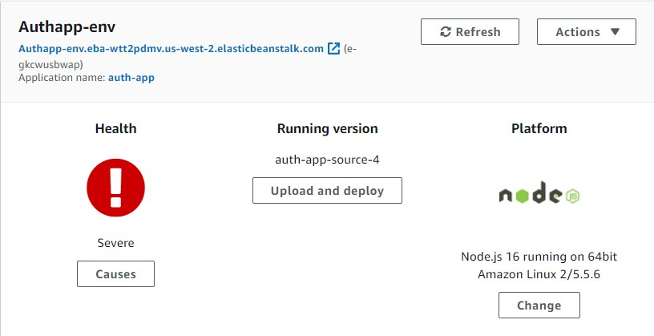
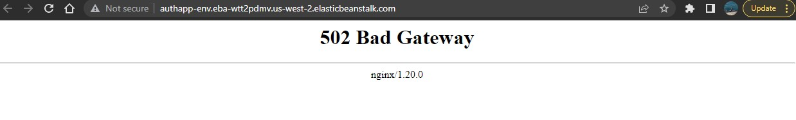
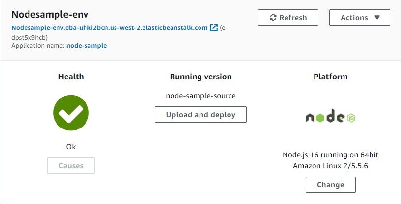
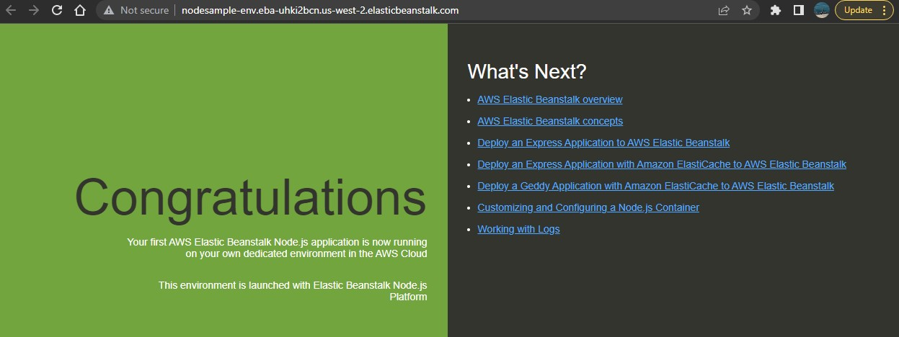

# cloud-server

## Overview

A Node.js server deployed to EC2 using Elastic Beanstalk

## Deployment

[__GUI Deployed Server__](http://authapp-env.eba-wtt2pdmv.us-west-2.elasticbeanstalk.com/)

[__GUI Deployed Test Server__](http://nodesample-env.eba-uhki2bcn.us-west-2.elasticbeanstalk.com/)

## Process/ Approach

Had issues deploying my own Node server to EC2, so opted to also deploy a Node test that AWS provided. I'm not sure if the issue lies in my zip file that I upload.

## Links

[Server Repo](https://github.com/Edward-Regalado/auth-team-project)

## Collaborators

- Jim Doyle
- Derek Douglas
- Hugo Thompson
- Zayah Lang
